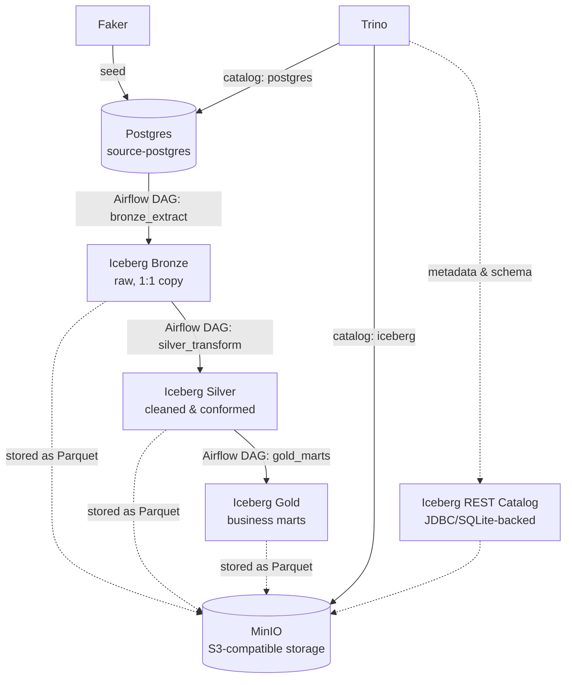

# Simple Open Source Data Lakehouse

A self-hosted, fully open-source data lakehouse built end-to-end with **Trino, MinIO, Apache Iceberg, PostgreSQL, and Apache Airflow** — implementing the **medallion architecture** (Bronze → Silver → Gold) over a synthetic e-commerce dataset.

Built as a hands-on learning project to understand the mechanics of a modern lakehouse stack: table formats, catalogs, object storage, distributed SQL query engines, and orchestration — without relying on any managed cloud service.

## Why this exists

Most "lakehouse in a box" tutorials stop at spinning up containers. This project goes further: it implements a real 3-layer medallion pipeline with orchestrated, verifiable data flow — Postgres seed data extracted into raw Bronze tables, cleaned and conformed into Silver, and aggregated into business-ready Gold marts — all queryable through a single SQL engine (Trino) across two different underlying systems (Postgres and Iceberg).

## Architecture



All orchestration is handled by **Airflow**, all SQL execution by **Trino**, and all table metadata (schemas, snapshots, partitions) by the **Iceberg REST Catalog** — decoupled from the actual Parquet data files sitting in **MinIO**.

## Tech stack

| Layer | Technology | Role |
|---|---|---|
| Orchestration | Apache Airflow 2.10 | Schedules and runs the Bronze/Silver/Gold DAGs |
| Query engine | Trino | Federated SQL across Postgres and Iceberg |
| Table format | Apache Iceberg | Schema evolution, snapshots, ACID-style semantics on object storage |
| Catalog | Iceberg REST Catalog | Tracks table/schema metadata (JDBC/SQLite-backed for persistence) |
| Object storage | MinIO | S3-compatible storage for Parquet data files |
| Source system | PostgreSQL | Simulated OLTP source, seeded with Faker |
| Infra | Docker Compose | Reproducible local multi-service environment |

## Data model

A synthetic e-commerce domain, seeded with [Faker](https://faker.readthedocs.io/):

```
customers ──┐
            ├──< orders ──< order_items >── products
```

- `customers` — name, email, created_at
- `products` — name, category, price
- `orders` — customer_id (FK), order_date, status
- `order_items` — order_id (FK), product_id (FK), quantity, unit_price

## The medallion pipeline

| Layer | DAG | What happens |
|---|---|---|
| 🟫 **Bronze** | `dags/bronze_extract.py` | Raw 1:1 copy of all 4 Postgres tables into Iceberg — no transformation, full historical fidelity |
| ⬜ **Silver** | `dags/silver_transform.py` | Dedup customers on email, filter invalid prices/quantities, enforce known order statuses, cast dates |
| 🟨 **Gold** | `dags/gold_marts.py` | Business marts: `daily_revenue`, `top_products`, `customer_ltv` — joined and aggregated from Silver |

Every DAG runs as a set of independent `TrinoOperator` tasks — one per table (Bronze/Silver) or per mart (Gold) — executing plain SQL against Trino's dual catalogs.

## Getting started

### Prerequisites
- Docker & Docker Compose
- Python 3.10+

### 1. Clone and configure
```bash
git clone https://github.com/imartem1s/simple-open-source-data-lake-house.git
cd simple-open-source-data-lake-house
cp .env.example .env   # fill in credentials (any values work locally)
```

### 2. Start the stack
```bash
docker compose up -d
```
This brings up Postgres, MinIO, the Iceberg REST catalog, Trino, and Airflow (webserver + scheduler + metadata DB).

### 3. Create the MinIO bucket and Iceberg schemas
Open the MinIO console (`http://localhost:9006`) and create a bucket named `lakehouse`, then register the three Iceberg schemas via Trino:
```bash
docker exec -it <trino-container> trino --execute "
CREATE SCHEMA iceberg.bronze WITH (location = 's3://lakehouse/bronze/');
CREATE SCHEMA iceberg.silver WITH (location = 's3://lakehouse/silver/');
CREATE SCHEMA iceberg.gold   WITH (location = 's3://lakehouse/gold/');
"
```

### 4. Seed the source data
```bash
python -m venv .venv && source .venv/bin/activate
pip install -r requirements.txt
python scripts/seed_postgres.py
```

### 5. Run the pipeline
Open the Airflow UI at `http://localhost:8081` (default login `airflow`/`airflow`) and trigger, in order:
1. `bronze_extract`
2. `silver_transform`
3. `gold_marts`

### 6. Query the results
```bash
docker exec -it <trino-container> trino --execute "SELECT * FROM iceberg.gold.daily_revenue ORDER BY order_date;"
```

## Project structure

```
.
├── docker-compose.yaml         # full stack: postgres, minio, iceberg-rest, trino, airflow
├── requirements.txt
├── .env.example                 # credential template (copy to .env)
├── dags/
│   ├── bronze_extract.py        # Postgres → Iceberg Bronze
│   ├── silver_transform.py      # Bronze → Iceberg Silver
│   └── gold_marts.py            # Silver → Iceberg Gold
├── scripts/
│   └── seed_postgres.py         # Faker-based source data generator
├── trino/catalog/
│   ├── iceberg.properties       # Iceberg REST catalog connector config
│   └── postgres.properties      # Postgres connector config
└── docs/
    └── PROJECT_LOG.md           # detailed build log: decisions, bugs, fixes
```

## Notable engineering decisions

- **Iceberg REST Catalog over Hive Metastore** — simpler operational model for a single-node learning setup, while still exposing the standard Iceberg REST API that any compliant engine can talk to.
- **JDBC/SQLite-backed catalog persistence** — the reference REST catalog fixture defaults to an in-memory metadata store; a full stack restart would silently lose all table registrations even though the underlying Parquet data survives in MinIO. Configured a SQLite-backed JDBC catalog on a named volume so metadata survives restarts.
- **Trino as the single query surface** — rather than writing Bronze extraction in Python, a second Trino catalog (PostgreSQL connector) was added so the *same* engine federates queries across the OLTP source and the lakehouse tables, keeping all transformation logic as portable SQL.
- **Declarative seed script** — `seed_postgres.py` models table generation as a dependency-ordered plan (table → columns → generator → dependencies) rather than a hand-wired sequence of function calls, so adding a new source table doesn't require rewiring `main()`.

See [`docs/PROJECT_LOG.md`](docs/PROJECT_LOG.md) for the full build narrative, including every bug encountered and how it was diagnosed and fixed.

## Roadmap

- [ ] Chain Bronze → Silver → Gold as a single dependent flow with scheduling and data quality checks
- [ ] Lightweight analytics dashboard querying the Gold layer directly via the Trino Python client

## License

No license file yet — treat as source-available for reference/learning purposes.
